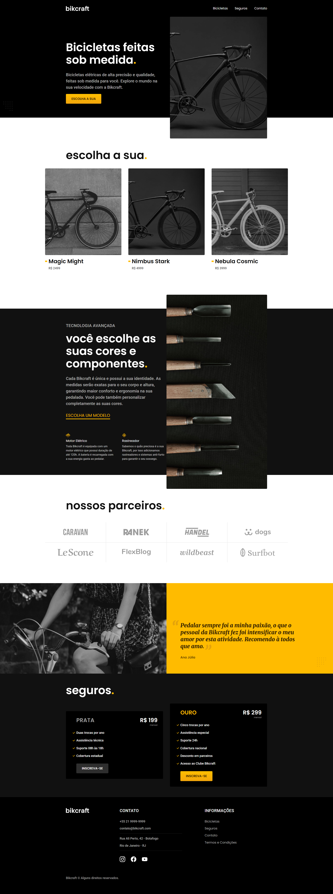
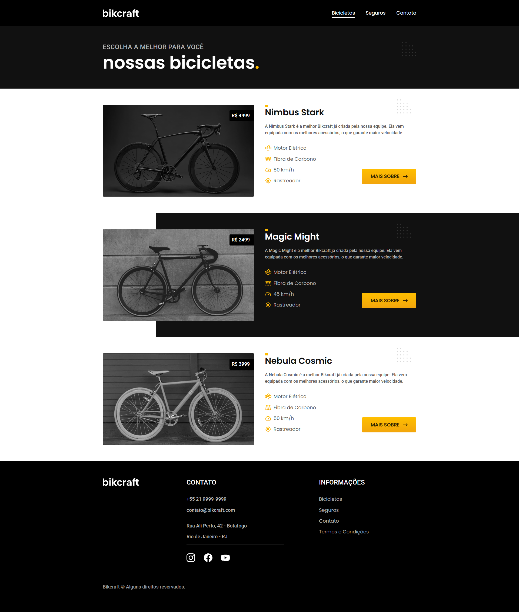
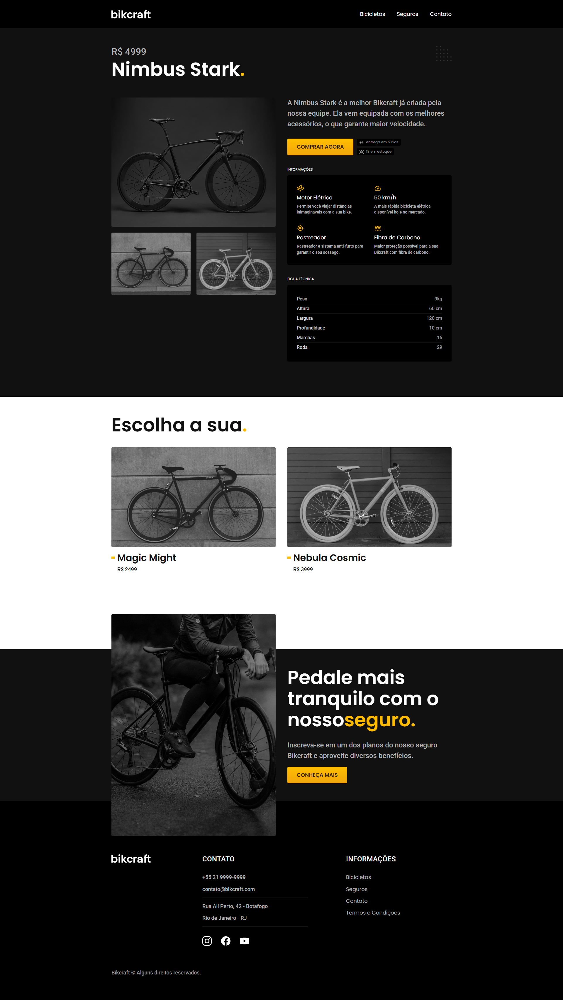
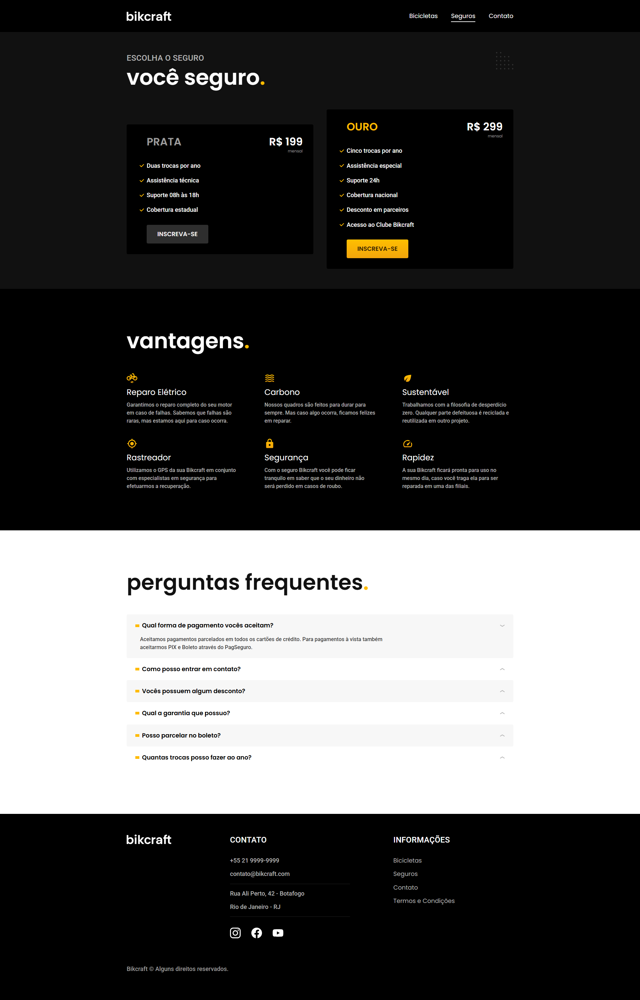
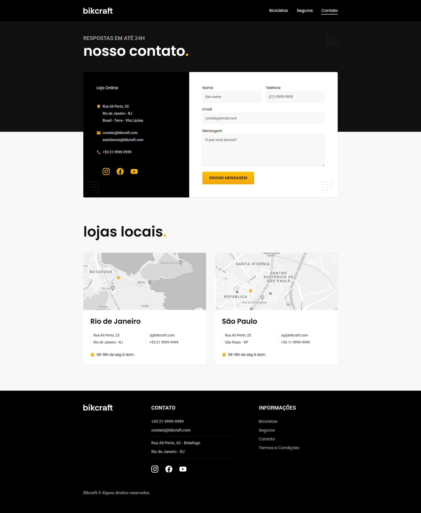
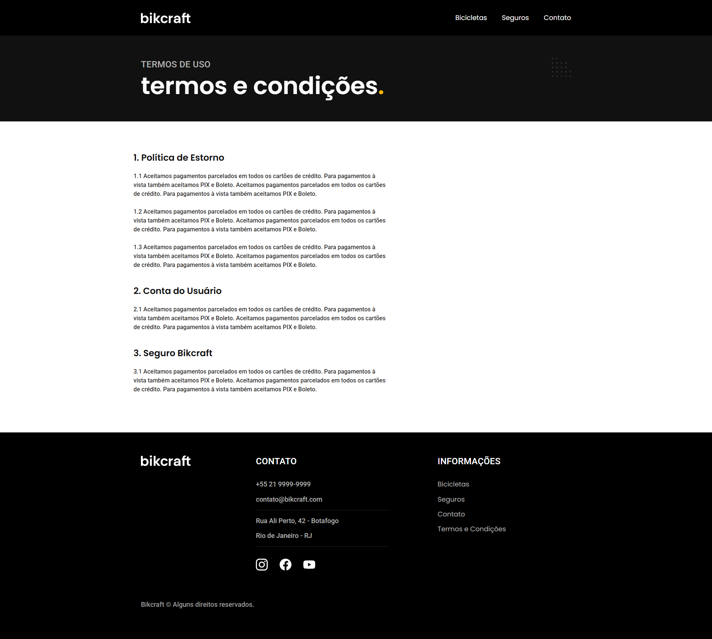
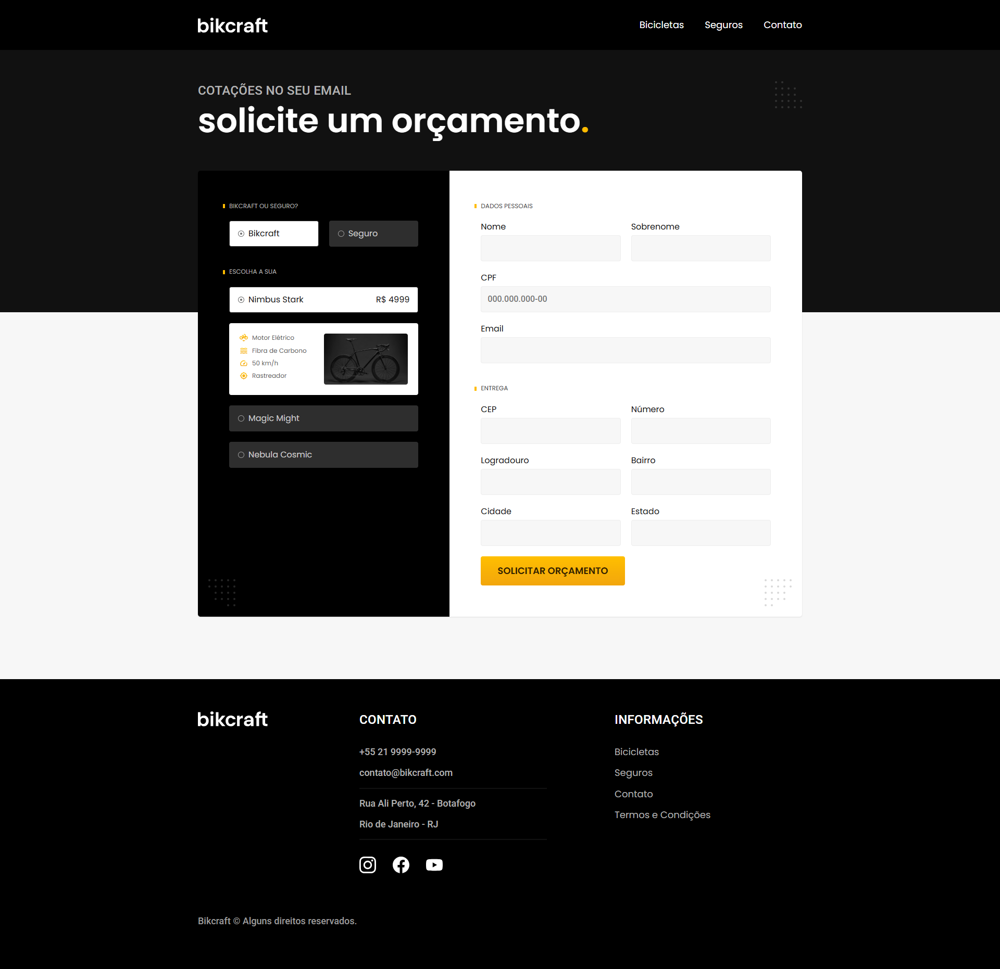

# 🚲 Bikcraft – Curso Origamid

Projeto desenvolvido como parte do curso **[HTML e CSS para Iniciantes](https://www.origamid.com/curso/html-e-css-para-iniciantes/)** da Origamid.  
O objetivo deste projeto foi criar um site fictício para uma empresa de **bicicletas personalizadas**, praticando **HTML5 semântico**, **CSS3 moderno** (Flexbox e Grid) e responsividade.

---

## 🚀 Preview

🔗 [Acesse o projeto online aqui](https://thur-code.github.io/bikcraft-origamid/)

---

---

---

---

---

---

---

## 🛠 Tecnologias utilizadas

- HTML5
- CSS3 (Flexbox, Grid Layout e responsividade)

---

## 🎯 Objetivos de aprendizado

- Estruturar um site completo com múltiplas páginas
- Criar layouts responsivos utilizando Grid e Flexbox
- Aprender boas práticas de design e organização de código
- Simular um projeto real de portfólio profissional

---

## 📂 Status do projeto

✅ Concluído

---

## 📝 Observações

Este projeto foi feito **de forma guiada**, seguindo as aulas do curso da Origamid.  
O design e o código foram mantidos conforme o exemplo do professor, com o objetivo de **consolidar os fundamentos de HTML e CSS** em um projeto completo.
